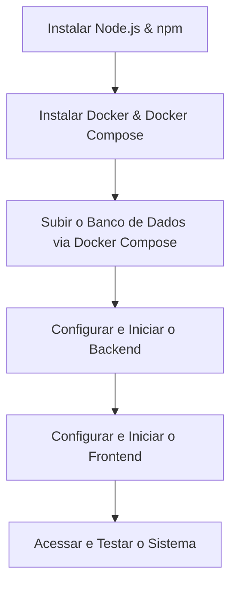

# 📖 Guia de Instalação e Configuração Completo — WMS Inviolável

Este guia foi elaborado para orientar você no passo a passo completo da instalação, configuração e execução da plataforma **WMS Inviolável**. 

O sistema possui uma arquitetura moderna dividida em três pilares principais:
1. **Frontend**: Interface SPA construída com **React + TypeScript + Vite** e estilizada com CSS de alto padrão.
2. **Backend**: Servidor API RESTful robusto feito em **Node.js + Express + TypeScript** com integração opcional à API do Google Gemini.
3. **Banco de Dados**: Banco relacional **PostgreSQL (v15+)** orquestrado e conteinerizado via **Docker**.

---

## 🗺️ Visão Geral do Fluxo de Instalação



---

## 🛠️ 1. Pré-requisitos: Instalação das Ferramentas Base

Se você já possui o Node.js e o Docker instalados, pode pular diretamente para a **Seção 2**. Caso contrário, siga as instruções abaixo para o seu sistema operacional.

### A. Node.js & npm

O Node.js é o ambiente de execução JavaScript utilizado para rodar o backend e o servidor de desenvolvimento do frontend.

#### 📦 Instalação via NVM (Recomendado para macOS/Linux)
O Node Version Manager (NVM) permite gerenciar múltiplas versões do Node.js facilmente.

*   **macOS / Linux:**
    ```bash
    curl -o- https://raw.githubusercontent.com/nvm-sh/nvm/v0.39.7/install.sh | bash
    ```
    Reinicie o terminal e instale a versão LTS do Node:
    ```bash
    nvm install --lts
    nvm use --lts
    ```

#### 💻 Instalação Direta
*   **Windows / macOS:** Baixe e execute o instalador oficial da versão **LTS (Recomendada para a maioria dos usuários)** diretamente em [nodejs.org](https://nodejs.org/).
*   **Linux (Ubuntu/Debian):**
    ```bash
    curl -fsSL https://deb.nodesource.com/setup_18.x | sudo -E bash -
    sudo apt-get install -y nodejs
    ```

> [!NOTE]
> **Verificação:** Para garantir que a instalação ocorreu com sucesso, execute em seu terminal:
> ```bash
> node -v
> npm -v
> ```
> O Node deve reportar versão `v18.x` ou superior, e o npm `v9.x` ou superior.

---

### B. Docker & Docker Compose

O Docker permite empacotar a aplicação e suas dependências dentro de contêineres virtuais. Usaremos o Docker para criar uma instância limpa do banco de dados PostgreSQL sem poluir o sistema operacional host.

*   **Windows / macOS:** Baixe e instale o **Docker Desktop** em [docker.com/products/docker-desktop](https://www.docker.com/products/docker-desktop).
    *   *Nota para Windows:* Certifique-se de habilitar o WSL 2 (Windows Subsystem for Linux) durante a instalação do Docker Desktop.
*   **Linux (Debian/Ubuntu):** Instale os pacotes `docker-ce` e `docker-compose-plugin` seguindo as instruções oficiais da sua distribuição.
    *   Certifique-se de adicionar seu usuário ao grupo docker para executar comandos sem `sudo`: `sudo usermod -aG docker $USER` e reinicie a sessão.

> [!NOTE]
> **Verificação:** Certifique-se de que o Docker daemon está rodando e execute no terminal:
> ```bash
> docker --version
> docker compose version
> ```

---

## 🚀 2. Inicializando o Banco de Dados (PostgreSQL via Docker)

O arquivo `docker-compose.yml` está localizado na pasta raiz do projeto e contém a definição do contêiner do PostgreSQL.

### Passo a Passo:

1. Abra o terminal e navegue até a pasta raiz do projeto (`INVENTORY-VIS/`).
2. Execute o comando a seguir para inicializar o contêiner do banco de dados em segundo plano (*detached mode*):
   ```bash
   docker compose up -d
   ```
3. Verifique se o contêiner está ativo e rodando normalmente:
   ```bash
   docker compose ps
   ```
   Você deverá ver uma saída indicando que o contêiner `wms_postgres` está `Up` (Ativo) e mapeado na porta `5432`.

### Informações de Acesso ao Banco de Dados:
*   **Host:** `localhost`
*   **Porta (Port):** `5432`
*   **Usuário (Username):** `inviolavel_user`
*   **Senha (Password):** `inviolavel_password`
*   **Nome do Banco (Database):** `inviolavel_wms`

> [!WARNING]
> Se você já tiver um serviço PostgreSQL rodando nativamente na sua máquina hospedeira, ocorrerá um conflito na porta `5432`. Consulte a **Seção de Resolução de Problemas (Troubleshooting)** no final deste guia para saber como desativar o serviço local temporariamente.

---

## ⚙️ 3. Configuração e Inicialização do Backend

O backend é a API REST que gerencia a lógica de negócios, auditorias, controle de concorrência por bloqueio de linhas do banco, e o motor de automação de backups.

1. No terminal, navegue até a pasta `backend`:
   ```bash
   cd backend
   ```
2. Instale todas as dependências do Node.js listadas no [package.json](file:///Users/bernardo/INVENTORY-VIS/backend/package.json):
   ```bash
   npm install
   ```
3. **Configuração das Variáveis de Ambiente (`.env`):**
   Crie um arquivo chamado `.env` dentro da pasta `backend/` com as configurações de porta e credenciais do banco de dados.
   
   Você pode criar o arquivo e colar a estrutura abaixo:
   ```env
   PORT=3001
   DB_HOST=localhost
   DB_PORT=5432
   DB_USER=inviolavel_user
   DB_PASSWORD=inviolavel_password
   DB_NAME=inviolavel_wms
   GEMINI_API_KEY=sua_chave_de_api_opcional_aqui
   ```
   *(Substitua `sua_chave_de_api_opcional_aqui` por uma API Key do Google Gemini se desejar obter sugestões reais baseadas em IA).*

4. Execute o servidor em ambiente de desenvolvimento:
   ```bash
   npm run dev
   ```

> [!TIP]
> **Autoinicialização Automática:** Na primeira vez que o backend inicia, ele detecta se as tabelas existem no banco. Se não existirem, ele cria automaticamente todo o esquema relacional, incluindo triggers PL/pgSQL avançados para controle de concorrência, índices de performance e carrega dados de teste (*seed* de produtos, movimentações, posições no estoque e usuários).

---

## 🖥️ 4. Configuração e Inicialização do Frontend

O frontend é uma aplicação de página única (SPA) de alta fidelidade visual, construída em React, que se comunica diretamente com a API do backend na porta `3001`.

1. Abra uma nova janela ou aba de terminal na raiz do projeto.
2. Navegue até a pasta `frontend`:
   ```bash
   cd frontend
   ```
3. Instale as dependências de desenvolvimento e de interface:
   ```bash
   npm install
   ```
4. Inicie o servidor local de desenvolvimento do Vite:
   ```bash
   npm run dev
   ```
5. Acesse a aplicação no seu navegador através do endereço exibido no console:
   *   **URL Padrão:** [http://localhost:5173](http://localhost:5173)

---

## 🔑 5. Perfis de Acesso Cadastrados (RBAC)

O sistema conta com Controle de Acesso Baseado em Funções (Role-Based Access Control). Na primeira execução do backend, as seguintes contas padrão são populadas no banco para fins de homologação:

| Usuário (Username) | Senha (Password) | Perfil (Role) | Descrição do Nível de Acesso |
| :--- | :--- | :--- | :--- |
| **`admin`** | `admin` | **Administrador** | Acesso completo a todas as páginas e ações. Pode cadastrar/editar/excluir produtos, gerenciar níveis do estoque, cadastrar usuários, baixar/excluir backups e restaurar o banco de dados. |
| **`operador`** | `operador` | **Operador** | Acesso operacional. Permite registrar movimentações de entrada e saída, visualizar o mapa físico de estoques e cumprir as tarefas de conferência diária. As guias de configurações, auditorias e backups ficam ocultas. |
| **`auditor`** | `auditor` | **Auditor** | Acesso de leitura e validação. Pode visualizar o estoque físico, o mapa, o histórico de movimentações da trilha de auditoria e a lixeira. Não tem permissão para cadastrar, editar, excluir ou restaurar dados. |

---

## 💾 6. Funcionamento da Central de Backups

A plataforma possui um sistema integrado de gerenciamento de backups do banco de dados relacional:

*   **Backup Automático:** O backend possui um serviço ativo que verifica a cada 1 hora se já existe um arquivo de backup referente ao dia atual. Caso não exista, um backup completo em formato `.json` é gerado na pasta `backend/backups/`.
*   **Retenção de Dados:** O sistema descarta automaticamente arquivos de backup que possuam mais de 7 dias de criação (pruning), mantendo o armazenamento limpo.
*   **Backups Manuais e Restauração:** Logado com a conta de **Administrador**, navegue em **Configurações > Backup do WMS** para criar cópias manuais sob demanda ou restaurar estados anteriores do sistema. 

---

## 🔍 7. Resolução de Problemas Comuns (Troubleshooting)

### A. Erro: "Port 5432 is already in use" ao rodar o Docker Compose
Este erro ocorre se você já possui um servidor PostgreSQL instalado diretamente em sua máquina host física rodando em segundo plano.

*   **Como resolver:**
    *   **macOS (via Homebrew):**
        ```bash
        brew services stop postgresql
        ```
    *   **Linux (systemd):**
        ```bash
        sudo systemctl stop postgresql
        ```
    *   **Windows:**
        1. Pressione `Win + R`, digite `services.msc` e aperte Enter.
        2. Encontre o serviço com nome `postgresql-...` na lista.
        3. Clique com o botão direito e selecione **Parar (Stop)**.
    *   Após parar o serviço local, execute `docker compose up -d` novamente.

### B. O Frontend exibe um banner vermelho escrito "Modo de Contingência (Local)"
Isso indica que a interface web não conseguiu se conectar à API backend (porta `3001`). O sistema entra em modo de demonstração offline usando dados do `localStorage` para evitar que a operação pare, mas não sincroniza com o banco de dados principal.

*   **Como resolver:**
    1. Verifique se o terminal do backend não travou ou reportou erros de conexão.
    2. Garanta que você executou `npm run dev` na pasta `backend/`.
    3. Certifique-se de que a variável `PORT=3001` no arquivo `.env` do backend está corretamente configurada.

### C. Recomendações de Compra por Inteligência Artificial aparecem como "local-simulation"
Se o painel do assistente de inteligência artificial exibir simulações estáticas em vez de análises detalhadas personalizadas:

*   **Como resolver:**
    1. Crie uma chave de API gratuita no [Google AI Studio](https://aistudio.google.com/).
    2. Adicione-a ao arquivo `.env` do backend na variável `GEMINI_API_KEY`.
    3. Reinicie o servidor do backend.

---
*WMS Inviolável — Desenvolvido com excelência técnica por Bernardo Rodrigues.*
